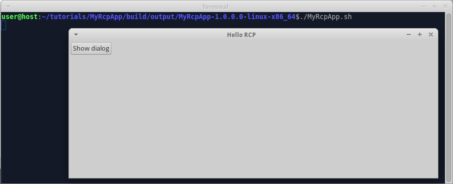

We already [added splash to RCP app](Add-splash-to-RCP-app). Now we add intro page to RCP app.

### Create intro page

Create folder "tutorials/MyRcpApp/src/main/resources/intro", create file "welcome.html" in it, insert code:

```html
<html>
  <head>
    <meta charset="UTF-8">
    <title>Welcome page</title>
    <link rel="stylesheet" type="text/css" href="default.css">
  </head>
  <body>
    <h1>Hello, world!</h1>
    <p>This is welcome page which you can customize.</p>
    <p>${project.name} Version ${project.version}</p>
  </body>
</html>
```

Create file "default.css" in the same folder, insert code:

```css
body {
  font-family: Arial;
  background-color: LightBlue;
  color: DimGray;
}

h1 {
  color: SteelBlue;
}
```

### Compile

Invoke on command line in "tutorials" folder: `gradle build`

Note that we don't have to configure intro page in configuration files - Wuff does this for us automatically. Concretely, when Wuff sees that file "src/main/resources/intro/welcome.html" exists, it decides to generate corresponding "introContent.xml" and extension-point in "plugin.xml".

### Run

Run the compiled product from command line. When the program is started for the first time, it displays intro page:


Note that intro page is filtered with groovy.text.SimpleTemplateEngine, so we can render arbitrary content on intro page with the help of java and groovy functions.

As soon as we close intro page, we see the default perspective:



---

The example code for this page: [tutorialExamples/RcpApp-6](../tree/master/tutorialExamples/RcpApp-6).

Next page: [Localize RCP app](Localize-RCP-app).