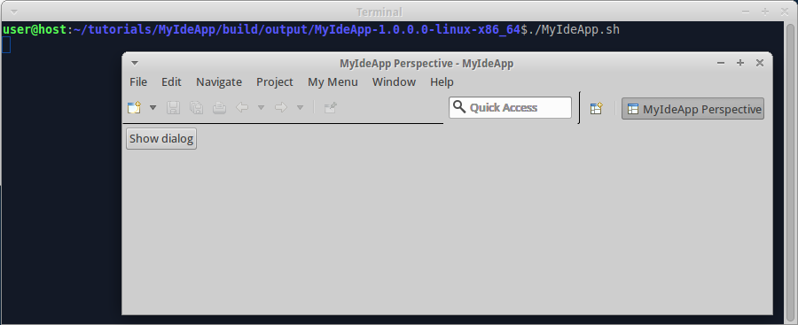

We already [created IDE bundle and used it in IDE app](Create-IDE-bundle-and-use-it-in-IDE-app). Now we add perspective and view to IDE app.

1. Create folder "tutorials/MyIdeApp/src/main/java/myideapp", create file "View.java" in it, insert code:

  ```java
  package myideapp;

  import org.eclipse.jface.dialogs.MessageDialog;
  import org.eclipse.swt.SWT;
  import org.eclipse.swt.widgets.Composite;
  import org.eclipse.swt.events.SelectionAdapter;
  import org.eclipse.swt.events.SelectionEvent;
  import org.eclipse.swt.layout.RowLayout;
  import org.eclipse.swt.widgets.Button;
  import org.eclipse.ui.part.ViewPart;

  public class View extends ViewPart {

    @Override
    public void createPartControl(final Composite parent) {
      parent.setLayout(new RowLayout());
      Button btnShowDialog = new Button(parent, SWT.PUSH);
      btnShowDialog.setText("Show dialog");
      btnShowDialog.addSelectionListener(new SelectionAdapter() {
        @Override
        public void widgetSelected(SelectionEvent event) {
          MessageDialog.openInformation(parent.getShell(), "Message", "There is no spoon.");
        }
      });
    }

    @Override
    public void setFocus() {
    }
  }
  ```

2. Create file "Perspective.java" in the same folder, insert code:

  ```java
  package myideapp;

  import org.eclipse.ui.IPageLayout;
  import org.eclipse.ui.IPerspectiveFactory;

  public class Perspective implements IPerspectiveFactory {

	  public void createInitialLayout(IPageLayout layout) {
		  layout.setEditorAreaVisible(false);
	  }
  }
  ```

3. Invoke on command line in "tutorials/MyIdeApp" folder:

  ```shell
  gradle clean build
  ```

  **Hint:** "clean" is needed only once, as soon as you introduced view or perspective. This way you remove cached information on IDE layout, that is stored in "configuration" subfolder of compiled product. Consequent builds can be done without "clean".

  Note that you don't have to configure view and perspective in "plugin.xml": Wuff does this for you automatically.

4. Run the compiled product from command line. As soon as program is fully started, you see new perspective and view with button:

  

  When you click the button, the program shows message dialog:

  
