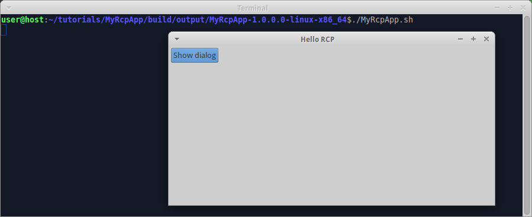

We already [prepared RCP app for multiproject build](Prepare-RCP-app-for-multiproject-build). Now we create Eclipse plugin and use it in RCP app.

1. Create folder "tutorials/MyPlugin", create file "build.gradle" in it, insert code:

  ```groovy
  apply plugin: 'java'
  apply plugin: 'eclipse-bundle'
  ```

2. Create folder "tutorials/MyPlugin/src/main/java/myplugin", create file "HelloWorld.java" in it, insert code:

  ```java
  package myplugin;

  import org.eclipse.jface.dialogs.MessageDialog;
  import org.eclipse.swt.widgets.Shell;

  public class HelloWorld {

    public static void showMessageDialog(Shell shell) {
      MessageDialog.openQuestion(shell, "Information", "Hello, world!");
    }
  }
  ```

3. Edit file "tutorials/settings.gradle", insert code:

  ```groovy
  include 'MyPlugin'
  ```
  so that there are two includes - "MyRcpApp" and "MyPlugin".

4. Edit file "tutorials/MyRcpApp/build.gradle", insert code:

  ```groovy
  dependencies {
    compile project(':MyPlugin')
  }
  ```

5. Edit file "tutorials/MyRcpApp/src/main/java/myrcpapp/View.java", replace content with:

  ```groovy
  package myrcpapp;

  import org.eclipse.swt.SWT;
  import org.eclipse.swt.widgets.Composite;
  import org.eclipse.swt.events.SelectionAdapter;
  import org.eclipse.swt.events.SelectionEvent;
  import org.eclipse.swt.layout.RowLayout;
  import org.eclipse.swt.widgets.Button;
  import org.eclipse.ui.part.ViewPart;

  public class View extends ViewPart {

    @Override
    public void createPartControl(final Composite parent) {
      parent.setLayout(new RowLayout());
      Button btnShowDialog = new Button(parent, SWT.PUSH);
      btnShowDialog.setText("Show dialog");
      btnShowDialog.addSelectionListener(new SelectionAdapter() {
        @Override
        public void widgetSelected(SelectionEvent event) {
          myplugin.HelloWorld.showMessageDialog(parent.getShell());
        }
      });
    }

    @Override
    public void setFocus() {
    }
  }
  ```

6. Invoke on command line in "tutorials" folder:
  ```shell
  gradle build
  ```

  **CHECK:** folder "tutorials/MyPlugin/build/libs" contains file "MyPlugin-1.0.0.0.jar", which is proper OSGi bundle with automatically generated manifest.

  **CHECK:** Each product in "tutorials/MyRcpApp/build/output" contains "MyPlugin" and "MyRcpApp" bundles in "plugins" subfolder and in "configuration/config.ini". 
  
4. Run the compiled product from command line. The expected output:
   
   

The example code for this page: [tutorialExamples/RcpApp-4](../tree/master/tutorialExamples/RcpApp-4).

Next page: [add splash to RCP app](Add-splash-to-RCP-app).