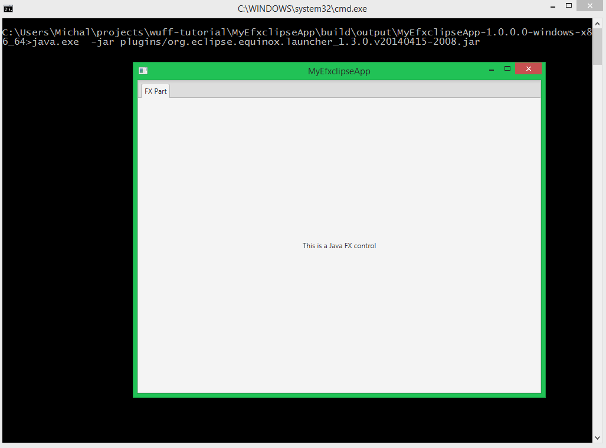

In this chapter we start from scratch and build an e(fx)clipse app.

### Create "build.gradle"

Create folder "tutorials/MyEfxclipseApp", create file "build.gradle" in it, insert code:

```groovy
buildscript {
  repositories {
    mavenLocal()
    jcenter()
  }
  
  dependencies {
    classpath 'org.akhikhl.wuff:wuff-plugin:+'
  }
}

apply plugin: 'java'
apply plugin: 'org.akhikhl.wuff.efxclipse-app'

wuff {
  selectedEclipseVersion = 'efxclipse-1.2'
}

products {
  nativeLauncher = false
}

repositories {
  mavenLocal()
  jcenter()
}
```

The script describes that we are using wuff gradle-plugin
and that we apply "eclipse-efxclipse-app" plugin to this project.

### Generate default sources

Invoke on command line: `gradle scaffold`. Scaffold task creates a plugin.xml, Application.e4xmi, and a sample part in the application. 

### Compile

Invoke on command line: `gradle build`.

Check: folder "tutorials/MyEfxclipseApp/build/libs" must contain file "MyEfxclipseApp_1.0.0.0.jar", which is proper OSGi bundle with an automatically generated manifest.

Check: folder "tutorials/MyEfxclipseApp/build/output" must contain efxclipse  product.

Check: the product must contain "MyEfxclipseApp" bundle in "plugins" subfolder and in "configuration/config.ini".

Attention: first build might be slow, because Wuff downloads e(fx)clipse and installs it's bundles into local maven repository ($HOME/.wuff/m2_repository). Consequent builds will be much faster.

Note: we don't have to program "MANIFEST.MF", "config.ini" - all these files are generated and inserted into the bundle and the product automatically.

### Run

Run the compiled product from command line. The expected output:
 
 

---

The example code for this page: [examples/EfxclipseApp-1](../tree/master/examples/EfxclipseApp-1).

Next page: [prepared Equinox app for multiproject build](Prepare-Equinox-app-for-multiproject-build)

