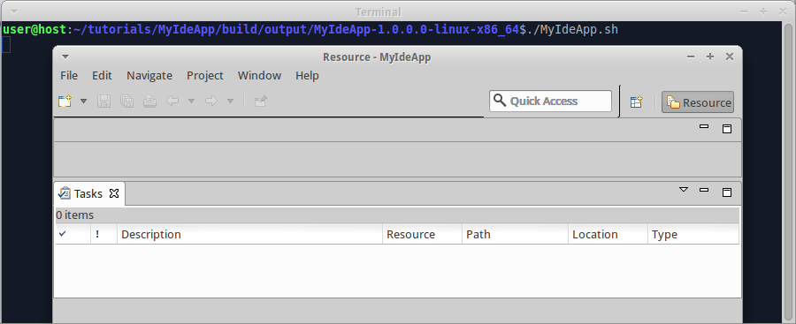

In this tutorial we start from scratch and build Eclipse IDE app.

### Create "build.gradle"

Create folder "tutorials/MyIdeApp", create file "build.gradle" in it, insert code:

```groovy
buildscript {
  repositories {
    mavenLocal()
    jcenter()
  }

  dependencies {
    classpath 'org.akhikhl.wuff:wuff-plugin:0.0.1'
  }
}

apply plugin: 'java'
apply plugin: 'eclipse-ide-app'

repositories {
  mavenLocal()
  jcenter()
}
```

### Compile

Invoke on command line: `gradle build`.

Check: folder "tutorials/MyIdeApp/build/libs" must contain file "MyIdeApp-1.0.0.0.jar", which is proper OSGi bundle with automatically generated manifest and "plugin.xml".

Check: there must be one product in "tutorials/MyIdeApp/build/output" folder. 

Check the product must contain "MyIdeApp" bundle in "plugins" subfolder and in "configuration/config.ini". 

Attention: first build might be slow, because Wuff downloads Eclipse and installs it's bundles into local maven repository ($HOME/.m2/repository). Consequent builds will be much faster.

Note that we don't have to program "plugin.xml", "MANIFEST.MF", "config.ini" - all these files are generated and inserted into bundle and product automatically. It's not even necessary to write any java code - we need only "build.gradle" and that's it.

### Run

Run the compiled product from command line. The program, when run for the first time, shows workspace selection dialog:


Fully started program looks like Eclipse IDE with "Resource" perspective:



---

The example code for this page: [examples/IdeApp-1](../tree/master/examples/IdeApp-1).

Next page: [Configure IDE products](Configure-IDE-products).