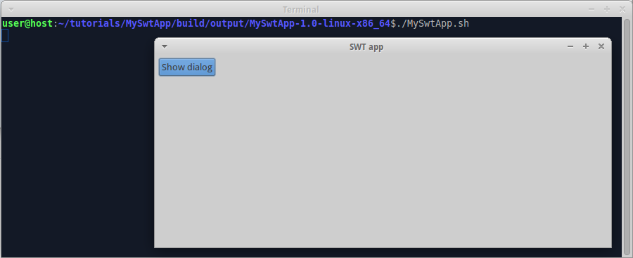
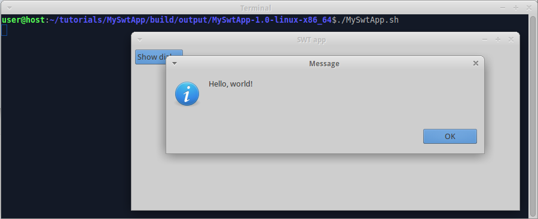

There are cases when using OSGi for Java GUI development is a bit of overkill. Imagine, we are developing a  simple GUI app, not requiring extension-points, preferences, workspaces etc.etc.

Exactly for such cases Wuff supports non-OSGi SWT apps. In this tutorial we start from scratch and build SWT app.

### Create "build.gradle"

Create folder "tutorials/MySwtApp", create file "build.gradle" in it, insert code:

```groovy
buildscript {
  repositories {
    mavenLocal()
    jcenter()
  }

  dependencies {
    classpath 'org.akhikhl.wuff:wuff-plugin:0.0.4'
  }
}

apply plugin: 'java'
apply plugin: 'swt-app'

repositories {
  mavenLocal()
  jcenter()
}

ext {
  mainClass = 'myswtapp.Main'
}
```

### Create sources

Create folder "tutorials/MySwtApp/src/main/java/myswtapp", create file "Main.java" in it, insert code:

```java
package myswtapp;

import org.eclipse.jface.dialogs.MessageDialog;
import org.eclipse.swt.SWT;
import org.eclipse.swt.events.SelectionAdapter;
import org.eclipse.swt.events.SelectionEvent;
import org.eclipse.swt.layout.GridData;
import org.eclipse.swt.layout.GridLayout;
import org.eclipse.swt.widgets.Button;
import org.eclipse.swt.widgets.Display;
import org.eclipse.swt.widgets.Shell;

public final class Main {

  public static void main(String[] args) {
    Display display = new Display();
    try {
      final Shell shell = new Shell(display);
      shell.setText("SWT app");
      shell.setLayout(new GridLayout(5, true));
      Button btnShowDialog = new Button(shell, SWT.PUSH);
      btnShowDialog.setText("Show dialog");
      btnShowDialog.setLayoutData(new GridData());
      btnShowDialog.addSelectionListener(new SelectionAdapter() {
        @Override
        public void widgetSelected(SelectionEvent event) {
          MessageDialog.openInformation(shell, "Message", "Hello, world!");
        }
      });
      shell.open();
      while (!shell.isDisposed())
        if (!display.readAndDispatch())
          display.sleep();
    } finally {
      display.dispose();
    }
  }
}
```

### Compile

Invoke on command line: `gradle build`.

Check: folder "tutorials/MySwtApp/build/libs" must contain file "MySwtApp-1.0.jar", which is usual JAR (not OSGi).

Check: there must be one product in "tutorials/MySwtApp/build/output" folder.

Check: the product must contain monolithic JAR file, containing all dependent JARS.

Check: the product must contain platform specific launch script: .bat-file for Windows, .sh-file for all other platforms.

Attention: first build might be slow, because Wuff downloads Eclipse and installs it's bundles into local maven repository ($HOME/.m2/repository). Consequent builds will be much faster.

Note that we don't have to add platform-specific SWT/JFace dependencies - Wuff does this for us automatically.

### Run

Run the compiled product from command line. Expect to see:



When we click on the button, the program shows message dialog:



---

The example code for this page: [examples/SwtApp-1](../tree/master/examples/SwtApp-1).

Next page: [Configure SWT products](Configure-SWT-products).