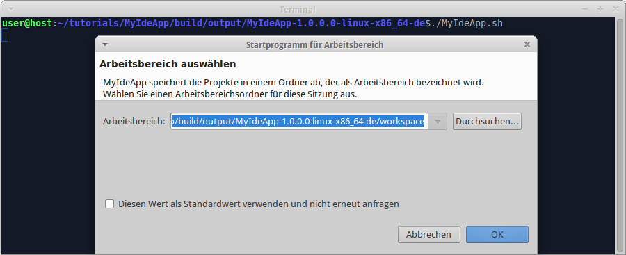
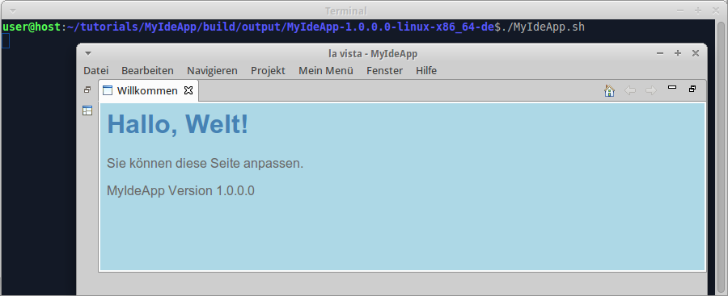
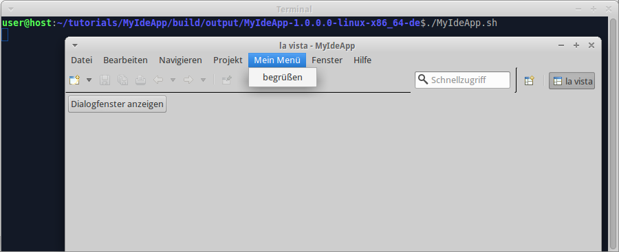
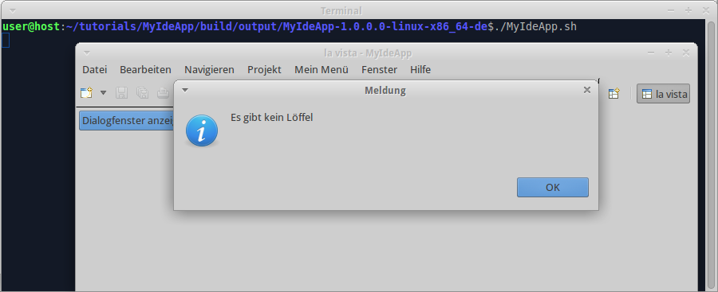

We already [added intro page to IDE app](Add-intro-page-to-IDE-app). Now we localize IDE app.

1. Add language-specific product definitions to "build.gradle":

  ```groovy
  products {
    product platform: 'linux', arch: 'x86_32'
    product platform: 'linux', arch: 'x86_32', language: 'de'
    product platform: 'linux', arch: 'x86_64'
    product platform: 'linux', arch: 'x86_64', language: 'de'
    product platform: 'windows', arch: 'x86_32'
    product platform: 'windows', arch: 'x86_32', language: 'de'
    product platform: 'windows', arch: 'x86_64'
    product platform: 'windows', arch: 'x86_64', language: 'de'
    archiveProducts = true
  }
  ```

  Here we define 8 products: 4 are English, 4 are German.

2. Create file "tutorials/MyIdeApp/src/main/java/myideapp/Messages.java", insert code:

  ```java
  package myideapp;

  import java.util.Locale;
  import java.util.ResourceBundle;

  public class Messages {

    private static ResourceBundle res = ResourceBundle.getBundle(Messages.class.getName(), Locale.getDefault());
    
    public static String getString(String key) {
      return res.getString(key);
    }  
  }
  ```

3. Edit file "tutorials/MyIdeApp/src/main/java/myideapp/View.java", replace literal strings with `Messages.getString` calls, so that the file looks like this:

  ```java
  package myideapp;

  import org.eclipse.jface.dialogs.MessageDialog;
  import org.eclipse.swt.SWT;
  import org.eclipse.swt.widgets.Composite;
  import org.eclipse.swt.events.SelectionAdapter;
  import org.eclipse.swt.events.SelectionEvent;
  import org.eclipse.swt.layout.RowLayout;
  import org.eclipse.swt.widgets.Button;
  import org.eclipse.ui.part.ViewPart;

  public class View extends ViewPart {

    @Override
    public void createPartControl(final Composite parent) {
      parent.setLayout(new RowLayout());
      Button btnShowDialog = new Button(parent, SWT.PUSH);
      btnShowDialog.setText(Messages.getString("btnShowDialog_Label"));
      btnShowDialog.addSelectionListener(new SelectionAdapter() {
        @Override
        public void widgetSelected(SelectionEvent event) {
          MessageDialog.openInformation(parent.getShell(), Messages.getString("dialogTitle"), Messages.getString("dialogMessage"));
        }
      });
    }

    @Override
    public void setFocus() {
    }
  }
  ```

4. Create folder "tutorials/MyIdeApp/src/main/resources/myideapp", create file "Messages.properties" in it, insert content:

  ```
  btnShowDialog_Label=Show dialog
  dialogTitle=Message
  dialogMessage=There is no spoon
  ```

5. Create file "Messages_de.properties" in the same folder, insert content:

  ```
  btnShowDialog_Label=Dialogfenster anzeigen
  dialogTitle=Meldung
  dialogMessage=Es gibt kein Löffel
  ```

6. Create file "tutorials/MyIdePlugin/src/main/java/myideplugin/Messages.java", insert code:

  ```java
  package myideplugin;

  import java.util.Locale;
  import java.util.ResourceBundle;

  public class Messages {

    private static ResourceBundle res = ResourceBundle.getBundle(Messages.class.getName(), Locale.getDefault());
    
    public static String getString(String key) {
      return res.getString(key);
    }  
  }
  ```

7. Edit file "tutorials/MyIdePlugin/src/main/java/myideplugin/MenuHandler.java", replace literal strings with `Messages.getString` calls, so that the file looks like this:

  ```java
  package myideplugin;

  import org.eclipse.core.commands.AbstractHandler;
  import org.eclipse.core.commands.ExecutionEvent;
  import org.eclipse.core.commands.ExecutionException;
  import org.eclipse.jface.dialogs.MessageDialog;
  import org.eclipse.ui.PlatformUI;

  public final class MenuHandler extends AbstractHandler {

    @Override
    public Object execute(ExecutionEvent event) throws ExecutionException {
      MessageDialog.openInformation(PlatformUI.getWorkbench().getActiveWorkbenchWindow().getShell(), 
        Messages.getString("dialogTitle"), Messages.getString("dialogMessage"));
      return null;
    }
  }
  ```

8. Create folder "tutorials/MyIdePlugin/src/main/resources/myideplugin", create file "Messages.properties" in it, insert content:

  ```
  dialogTitle=Message
  dialogMessage=Hello, world!
  ```

9. Create file "Messages_de.properties" in the same folder, insert content:

  ```
  dialogTitle=Meldung
  dialogMessage=Hallo, Welt!
  ```

10. Create folder "tutorials/MyIdePlugin/src/main/resources/OSGI-INF/l10n", create file "bundle.properties" in it, insert text:

  ```
  mnuMyMenu.title=My Menu
  cmdHelloWorld.title=Show greeting
  ```
11. Create file "bundle_de.properties" in the same folder, insert text:

  ```
  mnuMyMenu.title=Mein Menü
  cmdHelloWorld.title=begrüßen
  ```

12. Edit file "tutorials/MyIdePlugin/src/main/resources/plugin.xml", replace literal strings with percent-preceded variables, so that file looks like this:

  ```xml
  <?xml version="1.0" encoding="UTF-8"?>
  <?eclipse version="3.4"?>
  <plugin>
    <extension point="org.eclipse.ui.commands">
      <command id="cmdHelloWorld" name="%cmdHelloWorld.title" defaultHandler="myideplugin.MenuHandler">
      </command>
    </extension>
    <extension point="org.eclipse.ui.menus">
      <menuContribution allPopups="true" locationURI="menu:org.eclipse.ui.main.menu?after=additions">
        <menu id="MyMenu" label="%mnuMyMenu.title">
          <command commandId="cmdHelloWorld" style="push"/>
        </menu>
      </menuContribution>
    </extension>
  </plugin>
  ```

13. Create folder "tutorials/MyIdeApp/src/main/resources/nl/de/intro", then copy all files from "tutorials/MyIdeApp/src/main/resources/intro" into it.

14. Edit file "tutorials/MyIdeApp/src/main/resources/nl/de/intro/welcome.html", replace content with:

  ```html
  <html>
    <head>
      <meta charset="UTF-8">
      <title>Willkommen</title>
      <link rel="stylesheet" type="text/css" href="default.css">
    </head>
    <body>
      <h1>Hallo, Welt!</h1>
      <p>Sie können diese Seite anpassen.</p>
      <p>${project.name} Version ${project.version}</p>
    </body>
  </html>
  ```

15. Invoke on command line in "tutorials" folder: `gradle build`

16. Run the German-language product from command line. First of all, we see that workspace selection dialog is now localized:

  

  When program is started for the first time, it shows localized intro page:
  
  

  Note that localized intro page is also filtered with groovy.text.SimpleTemplateEngine, so we can render arbitrary content on intro page with the help of java and groovy functions.

  As soon as we close intro page, we see the default perspective with button and menu. All labels are localized:

  

  When we click the button or invoke our menu, the program displays localized message:

  

The example code for this page: [tutorialExamples/IdeApp-8](../tree/master/tutorialExamples/IdeApp-8).

Now we are done with IDE tutorial. Other tutorials are available [here](Tutorials).
