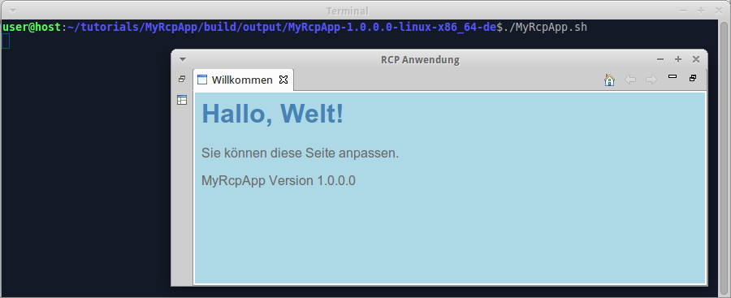

We already [added intro page to RCP app](Add-intro-page-to-RCP-app). Now we localize RCP app.

1. Add language-specific product definitions to "build.gradle":

  ```groovy
  products {
    product platform: 'linux', arch: 'x86_32'
    product platform: 'linux', arch: 'x86_32', language: 'de'
    product platform: 'linux', arch: 'x86_64'
    product platform: 'linux', arch: 'x86_64', language: 'de'
    product platform: 'windows', arch: 'x86_32'
    product platform: 'windows', arch: 'x86_32', language: 'de'
    product platform: 'windows', arch: 'x86_64'
    product platform: 'windows', arch: 'x86_64', language: 'de'
    archiveProducts = true
  }
  ```

  Here we define 8 products: 4 are English, 4 are German.

2. Create file "tutorials/MyRcpApp/src/main/java/myrcpapp/Messages.java", insert code:

  ```java
  package myrcpapp;

  import java.util.Locale;
  import java.util.ResourceBundle;

  public class Messages {

    private static ResourceBundle res = ResourceBundle.getBundle(Messages.class.getName(), Locale.getDefault());
    
    public static String getString(String key) {
      return res.getString(key);
    }  
  }
  ```

3. Edit file "tutorials/MyRcpApp/src/main/java/myrcpapp/View.java", replace line `btnShowDialog.setText("Show dialog");` with `btnShowDialog.setText(Messages.getString("btnShowDialog_Label"));`, so that the file looks like this:

  ```java
  package myrcpapp;

  import org.eclipse.swt.SWT;
  import org.eclipse.swt.widgets.Composite;
  import org.eclipse.swt.events.SelectionAdapter;
  import org.eclipse.swt.events.SelectionEvent;
  import org.eclipse.swt.layout.RowLayout;
  import org.eclipse.swt.widgets.Button;
  import org.eclipse.ui.part.ViewPart;

  public class View extends ViewPart {

    @Override
    public void createPartControl(final Composite parent) {
      parent.setLayout(new RowLayout());
      Button btnShowDialog = new Button(parent, SWT.PUSH);
      btnShowDialog.setText(Messages.getString("btnShowDialog_Label"));
      btnShowDialog.addSelectionListener(new SelectionAdapter() {
        @Override
        public void widgetSelected(SelectionEvent event) {
          myplugin.HelloWorld.showMessageDialog(parent.getShell());
        }
      });
    }

    @Override
    public void setFocus() {
    }
  }
  ```
4. Edit file "tutorials/MyRcpApp/src/main/java/myrcpapp/ApplicationWorkbenchWindowAdvisor.java", replace line `configurer.setTitle("Hello RCP");` with `configurer.setTitle(Messages.getString("WindowTitle"));`, so that the file looks like this:

  ```java
  package myrcpapp;

  import org.eclipse.swt.graphics.Point;
  import org.eclipse.ui.application.ActionBarAdvisor;
  import org.eclipse.ui.application.IActionBarConfigurer;
  import org.eclipse.ui.application.IWorkbenchWindowConfigurer;
  import org.eclipse.ui.application.WorkbenchWindowAdvisor;

  public class ApplicationWorkbenchWindowAdvisor extends WorkbenchWindowAdvisor {

    public ApplicationWorkbenchWindowAdvisor(IWorkbenchWindowConfigurer configurer) {
      super(configurer);
    }

    public ActionBarAdvisor createActionBarAdvisor(IActionBarConfigurer configurer) {
      return new ApplicationActionBarAdvisor(configurer);
    }
    
    public void preWindowOpen() {
      IWorkbenchWindowConfigurer configurer = getWindowConfigurer();
      configurer.setInitialSize(new Point(400, 300));
      configurer.setShowCoolBar(false);
      configurer.setShowStatusLine(false);
      configurer.setTitle(Messages.getString("WindowTitle"));
    }
  }
  ```

5. Create folder "tutorials/MyRcpApp/src/main/resources/myrcpapp", create file "Messages.properties" in it, insert content:

  ```
  WindowTitle=RCP application
  btnShowDialog_Label=Show dialog
  ```

6. Create file "Messages_de.properties" in the same folder, insert content:

  ```
  WindowTitle=RCP Anwendung
  btnShowDialog_Label=Dialogfenster anzeigen
  ```

7. Create file "tutorials/MyPlugin/src/main/java/myplugin/Messages.java", insert code:

  ```java
  package myplugin;

  import java.util.Locale;
  import java.util.ResourceBundle;

  public class Messages {

    private static ResourceBundle res = ResourceBundle.getBundle(Messages.class.getName(), Locale.getDefault());
    
    public static String getString(String key) {
      return res.getString(key);
    }  
  }
  ```

8. Edit file "tutorials/MyPlugin/src/main/java/myplugin/HelloWorld.java", replace line `MessageDialog.openInformation(shell, "Information", "Hello, world!");` with `MessageDialog.openInformation(shell, Messages.getString("DialogTitle"), Messages.getString("DialogMessage"));`, so that the file looks like this:

  ```java
  package myplugin;

  import org.eclipse.jface.dialogs.MessageDialog;
  import org.eclipse.swt.widgets.Shell;

  public class HelloWorld {

    public static void showMessageDialog(Shell shell) {
      MessageDialog.openInformation(shell, Messages.getString("DialogTitle"), Messages.getString("DialogMessage"));
    }
  }
  ```

9. Create folder "tutorials/MyPlugin/src/main/resources/myplugin", create file "Messages.properties" in it, insert content:

  ```
  DialogTitle=Message
  DialogMessage=Hello, world!
  ```

10. Create file "Messages_de.properties" in the same folder, insert content:

  ```
  DialogTitle=Meldung
  DialogMessage=Hallo, Welt!
  ```

11. Create folder "tutorials/MyRcpApp/src/main/resources/nl/de/intro", then copy all files from "tutorials/MyRcpApp/src/main/resources/intro" into it.

12. Edit file "tutorials/MyRcpApp/src/main/resources/nl/de/intro/welcome.html", replace content with:

  ```html
  <html>
    <head>
      <meta charset="UTF-8">
      <title>Willkommen</title>
      <link rel="stylesheet" type="text/css" href="default.css">
    </head>
    <body>
      <h1>Hallo, Welt!</h1>
      <p>Sie können diese Seite anpassen.</p>
      <p>${project.name} Version ${project.version}</p>
    </body>
  </html>
  ```

13. Invoke on command line in "tutorials" folder:

  ```shell
  gradle build
  ```

14. Run the German-language product from command line. When the program is started for the first time, it displays intro page:

  

  Note that localized intro page is also filtered with groovy.text.SimpleTemplateEngine, so you can render arbitrary content on intro page with the help of java and groovy functions.

  As soon as you close intro page, you see the default perspective:

  

The example code for this page: [tutorialExamples/RcpApp-7](../tree/master/tutorialExamples/RcpApp-7).

Now we are done with RCP tutorial. Other tutorials are available [here](Tutorials).
